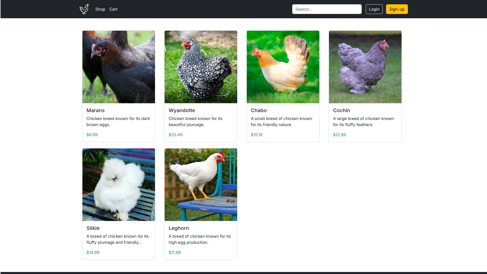
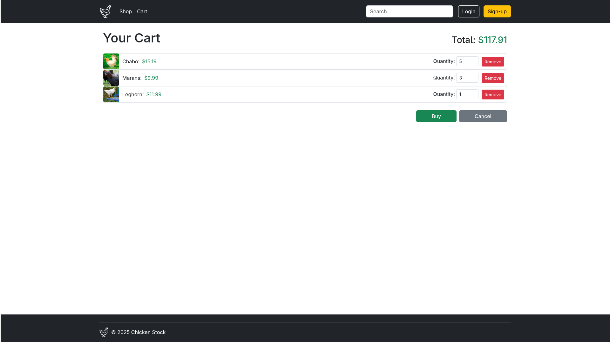

# Chicken-Stock
Project made for Advanced Internet Applications laboratories at Poznań University of Technology.

# Description
This project implements a simple frontend chicken shop web application using Express, SQLite, TypeScript, and Bootstrap.

